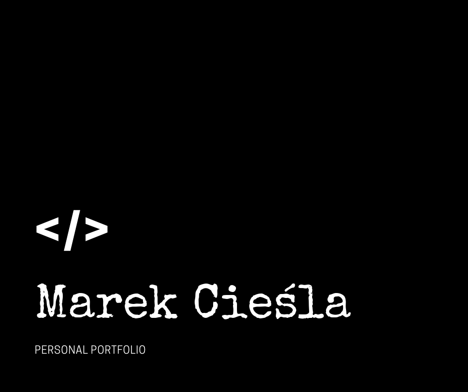

# Personal website

My personal website built during WTF - Co Ten Frontend course.

## Used tools and technologies:

- Visual Studio Code
- Git
- Figma
- SASS (SCSS)
- Fetch API
- Event Listeners
- CSS Grid
- Flexbox
- CSS Transitions
- Media queries
- DOM
- Semantic HTML

## Built with wtf-gulp-starter

`npm install -g gulp-cli`

`npm install`

`gulp`

To publish your page using github pages use `npm run deploy`
